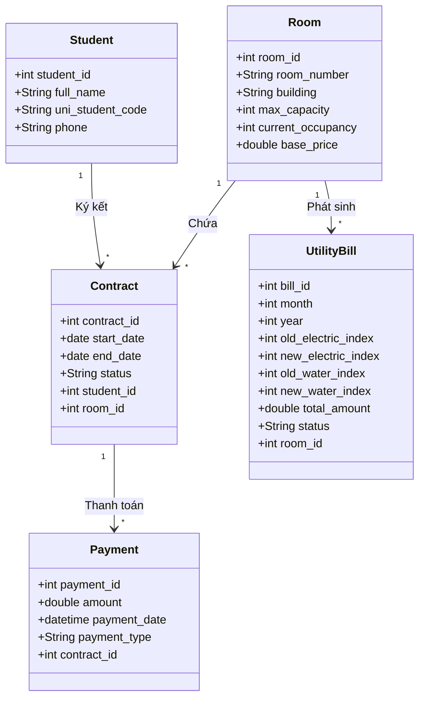

# BÁO CÁO BÀI TẬP THỰC HÀNH SỐ 2

## 1. Thông tin nhóm sinh viên
- Sinh viên 1: Chu Thanh Tan - 23010165
- Sinh viên 2: Dang Hai Nam - 23010068
- Sinh viên 3: Le Hai Son - 23010722
- Giảng viên phụ trách: @lethunguyen

## 2. Tên dự án cuối kỳ của Nhóm
Xây dựng và vận hành hệ thống quản lý ký túc xá sinh viên

## 3. Phân tích bài toán

### 3.1. Phân tích các đối tượng (Entities)
* *Student (Sinh viên):* Người lưu trú trong ký túc xá, chứa thông tin cá nhân cơ bản và mã sinh viên.
* *Room (Phòng KTX):* Thông tin về phòng lưu trú (thuộc tòa nhà nào, sức chứa tối đa, số người đang ở hiện tại, mức giá thuê).
* *Contract (Hợp đồng):* Giao dịch thuê phòng của sinh viên, xác định thời hạn lưu trú (ngày bắt đầu, ngày kết thúc) của một sinh viên tại một phòng cụ thể.
* *UtilityBill (Hóa đơn điện nước):* Bảng ghi nhận chỉ số điện, nước đầu tháng và cuối tháng của từng phòng để tính toán chi phí sinh hoạt.
* *Payment (Thanh toán):* Ghi nhận các khoản đóng tiền thực tế của sinh viên (bao gồm tiền cọc, tiền thuê phòng).

### 3.2. Mối quan hệ giữa các đối tượng

* *Room - Contract:* 1 - N (Một phòng có nhiều hợp đồng của các sinh viên khác nhau cùng lưu trú).
* *Student - Contract:* 1 - N (Một sinh viên có thể gia hạn hoặc ký nhiều hợp đồng qua các học kỳ/năm học).
* *Room - UtilityBill:* 1 - N (Mỗi tháng, một phòng sẽ phát sinh một hóa đơn điện nước mới).
* *Contract - Payment:* 1 - N (Một hợp đồng thuê phòng có thể được thanh toán chia làm nhiều đợt khác nhau).
* 
### 3.3. UML Class Diagram

